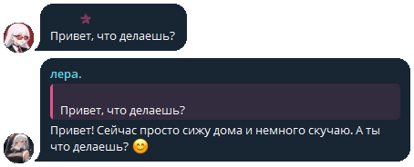

# LeraRP — экспериментальный проект
LeraRP — экспериментальный проект в виде телеграм бота с LLM моделью, для ответа на естественном языке, соблюдая заданую роль.

## Настройка

В конфиге вы можете настроить все нужные базовые вещи, такие как:
 - Роль, стикеры, стартовое сообщение
 - Модель
 - Свой API-ключ и base-url
  

В будующеем будет добавлена нормальная рандомизация ответа и настройка шанса ответа в конфиге.
